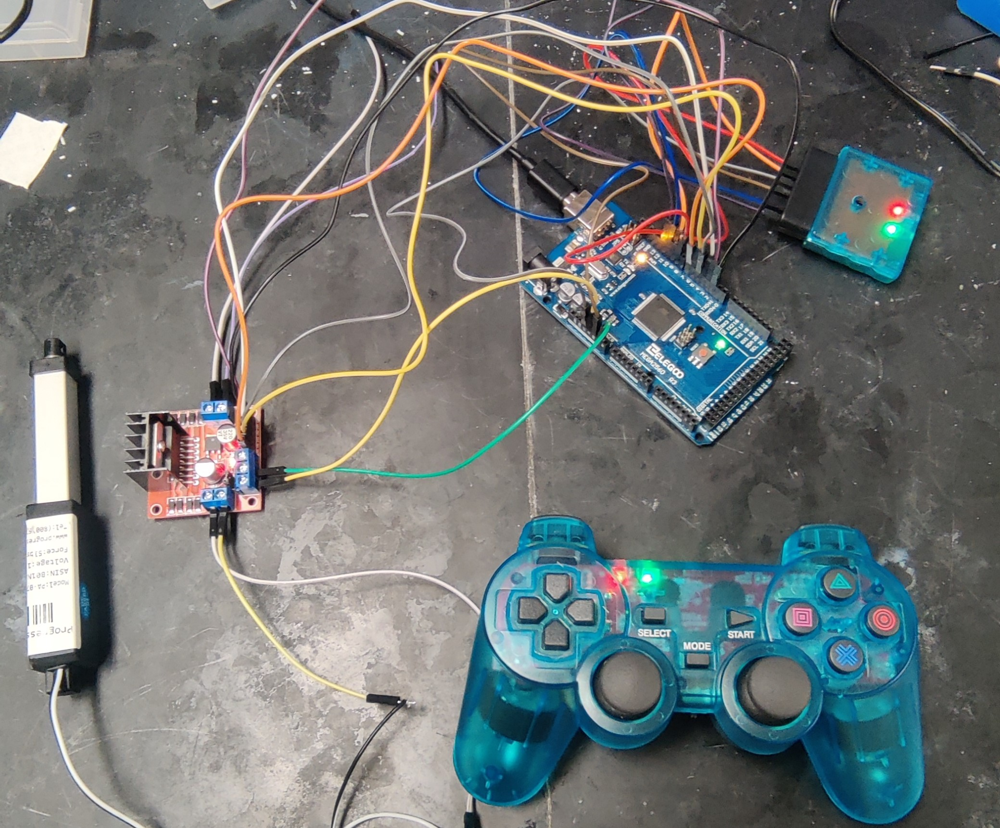
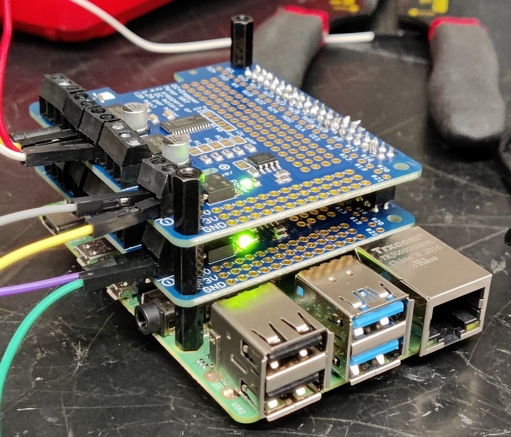

# Pipeline Inspection Robot
It is a project done for [U.S. DOT Pipeline and Hazardous Materials Safety Administration](https://www.phmsa.dot.gov/). I would like to thank [Professor Yongming Liu](https://search.asu.edu/profile/436365), founder of [PARA Lab, ASU](https://paralab.engineering.asu.edu/people/) for giving me an opportunity to work in this project.

The primary objective of this project is to determine the uncertainty of the gas pipelines with respect to the defects of the inner wall of the pipeline using a computer vision enabled depth camera. But it was imperative that the camera should be able to scan for the entire length of the pipeline. So there was a requirement of a robot to augment the following process.

The robot should be capable of doing the following activities: -
* It should be capable of moving inside the pipe.
* It should house the depth camera and allow it to rotate 3600 in different speeds and both direction.
* It should be capable of wireless control when the robot is inside the pipeline.
* It should house its own power supply.
* It should be able to adjust the altitude of the camera with respect to the diameter of the pipe.
 

## Arduino version of the robot
This is an image of the robot frame CAD model designed by [Mr.Rohith Kalyan Kavadapu](https://www.linkedin.com/in/rohith-kalyan-kavadapu/)

The robot consists of following hardware elements: -
- 1x [NEMA-17 Bipolar Stepper motor](https://www.digikey.com/en/products/detail/trinamic-motion-control-gmbh/QSH4218-51-10-049/4843427?s=N4IgjCBcpgLFoDGUBmBDANgZwKYBoQB7KAbRACZYBOAVgA4A2EAXQIAcAXKEAZQ4CcAlgDsA5iAC%2BBAMxUADAhDJI6bPiKkQNKgyrxWITtz5CxkggwDsNRctW4CxSGWlgql9y3ZdIvASPEpCnJKW1RMBw1nCjkFAyNfABFCAFcAIwwccxAAWnIwyAEU9ScyG2YJIPzo4RwAWzQAAjBLFgkgA)
- 2x [PA-07 Linear Actuator](https://images-na.ssl-images-amazon.com/images/I/A12fkCZbVcL.pdf)
- 2x [Encoder Metal Gearmotor](https://gistgear.com/product/B07GNGGCVP)

The frame is extracted from [Yahboom G1 Tank Robot](https://category.yahboom.net/products/g1tank) as it has enough space to house the circuitry of the robot.

Firstly [Arduino Mega 2560T](https://store-usa.arduino.cc/products/arduino-mega-2560-rev3?selectedStore=us) microcontroller was used to control the elements of the robot
and for wireless control of the robot, [a wireless PS2 console with receiver](https://www.aliexpress.com/item/3256802091612214.html?spm=a2g0o.productlist.main.3.3f7233f2mgTtwv&algo_pvid=6e6fdc5c-17b3-453b-be27-cf4d24ffc3d4&algo_exp_id=6e6fdc5c-17b3-453b-be27-cf4d24ffc3d4-1&pdp_ext_f=%7B%22sku_id%22%3A%2212000019882328062%22%7D&pdp_npi=2%40dis%21USD%218.62%218.62%21%21%21%21%21%40210217fe16624359715848540d073b%2112000019882328062%21sea&curPageLogUid=mezlEgkJVCH2) was used. The receiver of the PS2 wireless console, when connected with the Arduino board by means of jumper wire allows us to send signal to the Arduino by means of PS2 Console. This [link](https://create.arduino.cc/projecthub/igorF2/arduino-robot-with-ps2-controller-playstation-2-joystick-85bddc) will give a better understanding for connecting the PS2 receiver with Arduino microcontroller

 

As the programming of Arduino is done using C, the [Arduino-PS2X Library](https://github.com/madsci1016/Arduino-PS2X) could be added to the Arduino IDE. With help of this library every buttons of the console could be accessed for individual function(s).

### DC Motor Control
In total the robot consists of 4 DC Motors (including 2 Linear Actuators) and 1 Stepper motor. So for control of the DC motors, [L289N Motor Drivers](https://lastminuteengineers.com/l298n-dc-stepper-driver-arduino-tutorial/) were used. This driver enables both speed and direction control of DC motors as it is capable of working with PWM signals for speed control and it has an in-built H-bridge for direction control. Therefore by using two of these, 4 DC motors could be controlled individually.

### Stepper Motor Control
The main purpose of using a stepper motor to rotate the camera, instead of a DC motor is for a proper scan of the inner wall by camera, the rotation of the camera should be as slow and smooth as possible. If not slow, then it will result in poor quality of depth image. The [A4988 Stepper Motor Driver](https://www.pololu.com/product/1182) aids in speed and direction control of NEMA-17 bipolar stepper motor. Well, the only disadvantage of this driver is that in order to use the driver it needs to be inserted into a breadboard unlike L298N Motor Driver. This driver enables to microstep the stepper motor to its 1/16 of its base speed. The another disadvantage of this driver is that sometimes, it gets heated quickly which in turn damages the IC of the driver. This [link](https://lastminuteengineers.com/a4988-stepper-motor-driver-arduino-tutorial/) will give a better understanding of using the driver for stepper motor control.

The arduino program written for these drivers are quite primitive where the fucntions of the drivers were activated using simple HIGH and LOW signals from Arduino microcontroller. By combining all the drivers and hardware elements together, it was possible to attain a sequential control of the robot. But there was a necessity to upgrade the existing controller. So the Arduino Mega 2560 was replaced with [Raspberry Pi 4 Model B](https://www.raspberrypi.com/products/raspberry-pi-4-model-b/) Single Board Computer.

## Raspberry version of the robot
Raspberry Pi has a lot of advantages over Arduino such as Wireless connection to the computer unlike Arduino, high processing power(8 GB), bluetooth equipped which enables to upgrade the wireless control module from PS2 to [PS4 Wireless Console](https://www.playstation.com/en-us/accessories/dualshock-4-wireless-controller/), supports programming such as Python, C++ etc., streaming of data to an external computer via wireless connection. 

As the controller is changed from Arduino to Raspberry Pi, it gave an opportunity to improve the Console from PS2 to PS4 it spares the external receiver module. Since the motor drivers are unchanged the existing program is being converted to Python script.

Firstly the RaspiOS is installed onto a SD Card and two files, **ssh** and **wpa_supplicant.conf** are being added to the sd card. This [link](https://linuxhint.com/rasperberry_pi_wifi_wpa_supplicant/) will give a clear picture of how to connect with a Raspberry Pi SBC in a wireless manner. After converting the program to Python script. In addition, [AS5600 rotary encoder](https://ams.com/en/as5600) was installed externally over the rear end of the NEMA-17 shaft. As there is no proper library for Raspberry Pi to process the signals, so the encoder is connected to [Arduino Uno](https://store-usa.arduino.cc/products/arduino-uno-rev3) by means of jumper cables and then, Arduino Uno is connected to Raspberry Pi by means of USB Serial Connection. Then that angular data could be streamed simultaneously to the main server.  

After deciding, all the circuitry were transferred to the robot frame and trial-tested. This is an image of the robot with all the circuitry.

One of the major problems was the complexity in circuitry due to bunch of jumper wires between all the hardware elements, Raspberry Pi and Arduino which is kind of messy. And the other problem is, it takes a lot of time to cross-check the connections if any one of the connections gets messed up. So in order to resolve this issue, the existing circuitry need to be optimized. Therefore the drivers were replaced by Adafruit DC and Stepper Motor HAT

## Replacement of motor drivers with Hardware Attached on Top (HAT)

It has lot of advantages over conventional drivers, one of them is that the wiring required could be reduced to half and when it comes to using the drivers, in order to use it for different purposes, the programming logic was kind of primitive i.e., in terms of HIGH and LOW pulses for activating the functions of the drivers. But in the case HAT's, it does have its own library compatible for python. With its inbuilt functions, the programming was simplified to a great extent and to mention, it is possible to stack HAT's one upon another. 

But it does have a disadvantage, as the HAT's are stacked upon Raspberry Pi, it will not be possible to access any GPIO pins for any other use. This [link](https://learn.adafruit.com/adafruit-dc-and-stepper-motor-hat-for-raspberry-pi/stacking-hats?view=all&gclid=Cj0KCQjwjbyYBhCdARIsAArC6LJzinDjJiDytur5MnukkRWa7DaCcHueU-hqwE7uCNn5JgHK09tOKbQaAuCOEALw_wcB#stacking-hats) gives a better idea about stacking of HAT's.

All the elements are being transferred to HAT and then the, robot is being made functional for trials inside the pipeline.

## Future Scope of Work
* Design Alteration of the belt assembly to make radial contact with the inner wall of the gas pipeline.
* Implementation of ROS to localize the robot inside the gas pipeline using visual SLAM.

## Credits
I would like to thank [Mr.Rahul Rathnakumar](https://www.linkedin.com/in/rahulkumaraviator/) for guiding me whenever I needed. I would also like to extend my thanks to [Mr.Rohith Kalyan Kavadapu](https://www.linkedin.com/in/rohith-kalyan-kavadapu/) and [Mr.Abhishek Shrinivas Loganathan](https://www.linkedin.com/in/abhishek-shrinivas-loganathan-b529081a9/) for helping me in this project. 

